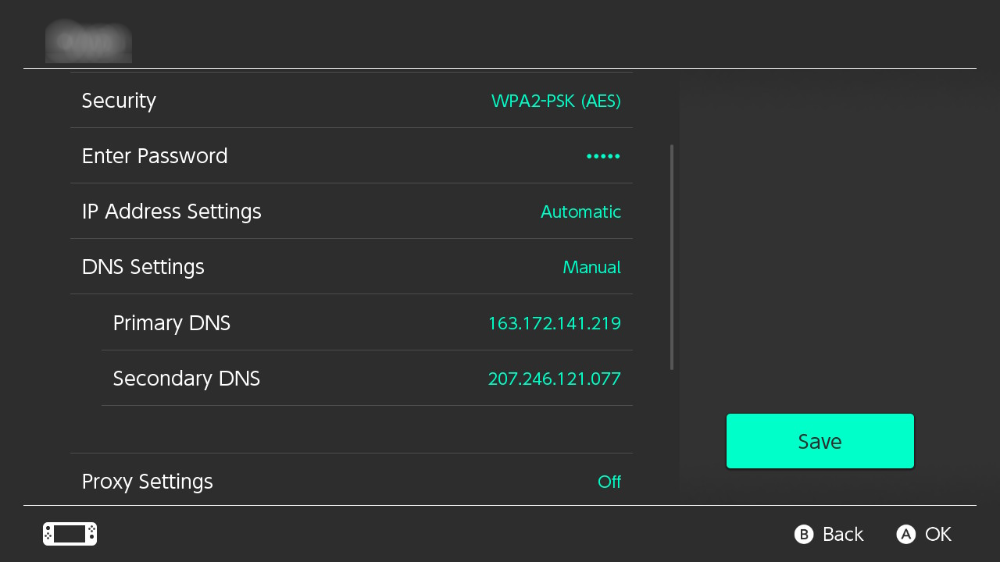
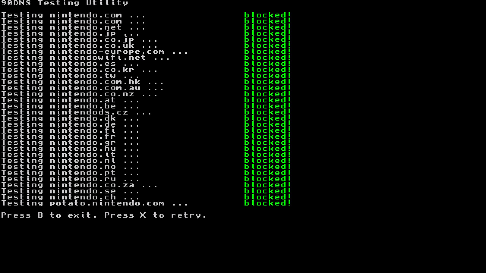

# Blocking Nintendo servers

This page will help you set up a method to block all communication with Nintendo. This will stop any updates and reporting to Nintendo, but it will prevent use of the eShop and online games.

## Instructions (DNS.MITM)
You can configure Atmosphère to automatically redirect any requests directed to Nintendo to nothing instead. Documentation about this feature can be [found here](https://github.com/Atmosphere-NX/Atmosphere/blob/master/docs/features/dns_mitm.md). The section below will help you set up DNS redirection on your emuMMC. Note that this will only apply when you are using your emuMMC (unless applied on sysCFW).

### What you need:
- The <a href="/files/emummc.txt" download>emummc.txt</a> file
- Atmosphère 0.18.0 or higher

### Setup:

1. Enter RCM and inject the hekate payload.
    - If you use a modchipped Switch, you can simply just turn your Switch on with the hekate payload renamed to `payload.bin` on the root of your SD.
1. Navigate to `Tools` > `USB Tools` > `SD Card` and plug your Switch into your PC via USB.
1. Enter the `atmosphere` folder.
1. If it doesn't exist already, create a folder named `hosts` in the `atmosphere` folder.
    - You should end up with the `sd:/atmosphere/hosts` directory.
1. Copy the `emummc.txt` file into the hosts folder.
    - If you want to apply the DNS redirection to sysMMC instead of emuMMC, rename the file to `sysmmc.txt`.
1. Eject the `UMS` device safely from within your computer's operating system and boot into CFW.

::: tip

**Verifying functionality**

You can verify the functionality of the DNS redirection by booting into emuMMC (or sysCFW, if you applied the config to sysCFW), and powering off afterwards.

A report will be generated in `sd:/atmosphere/logs` called `dns_mitm_startup.log`. If this file contains the following text, the DNS redirection is active.

```js
DNS Mitm:
Adding defaults to redirection list.
Selecting hosts file...
Skipping /hosts/emummc_<emummc_id>.txt because it does not exist...
Selected /hosts/emummc.txt
Redirections:
    `*ctest.cdn.nintendo.net` -> 95.216.149.205
    `*conntest.nintendowifi.net` -> 95.216.149.205
    `*nintendoswitch.cn` -> 127.0.0.1
    `*nintendoswitch.com.cn` -> 127.0.0.1
    `*nintendoswitch.com` -> 127.0.0.1
    `*nintendo.pl` -> 127.0.0.1
    `*nintendo.ch` -> 127.0.0.1
    `*nintendo.se` -> 127.0.0.1
    `*nintendo.co.za` -> 127.0.0.1
    `*nintendo.ru` -> 127.0.0.1
    `*nintendo.pt` -> 127.0.0.1
    `*nintendo.no` -> 127.0.0.1
    `*nintendo.nl` -> 127.0.0.1
    `*nintendo.it` -> 127.0.0.1
    `*nintendo.hu` -> 127.0.0.1
    `*nintendo.gr` -> 127.0.0.1
    `*nintendo.fr` -> 127.0.0.1
    `*nintendo.fi` -> 127.0.0.1
    `*nintendo.de` -> 127.0.0.1
    `*nintendo.dk` -> 127.0.0.1
    `*nintendods.cz` -> 127.0.0.1
    `*nintendo.be` -> 127.0.0.1
    `*nintendo.at` -> 127.0.0.1
    `*nintendo.co.nz` -> 127.0.0.1
    `*nintendo.com.au` -> 127.0.0.1
    `*nintendo.com.hk` -> 127.0.0.1
    `*nintendo.tw` -> 127.0.0.1
    `*nintendo.co.kr` -> 127.0.0.1
    `*nintendo.es` -> 127.0.0.1
    `*nintendowifi.net` -> 127.0.0.1
    `*nintendo-europe.com` -> 127.0.0.1
    `*nintendo.co.uk` -> 127.0.0.1
    `*nintendo.co.jp` -> 127.0.0.1
    `*nintendo.jp` -> 127.0.0.1
    `*nintendo.net` -> 127.0.0.1
    `*nintendo.com` -> 127.0.0.1
    `receive-lp1.er.srv.nintendo.net` -> 127.0.0.1
    `receive-lp1.dg.srv.nintendo.net` -> 127.0.0.1
```
:::

## Instructions (90DNS)
You can add a custom DNS to your Wi-Fi connection that will block all communication with Nintendo's servers. We will be using [90DNS](https://gitlab.com/a/90dns), a community-run custom DNS server. If you prefer, you can run your own DNS server following the instructions on the [GitLab repository.](https://gitlab.com/a/90dns/blob/master/SELFHOST.md)

Enter the console's `System Settings`, and then proceed to the `Internet` tab. From here you can choose one of the 3 methods of setting up 90DNS below, depending on what you currently have set up on your Switch.

- Follow the [Setting up a new connection via Wi-Fi](#setting-up-a-new-connection-via-wi-fi) section if you wish to set up 90DNS on a Wi-Fi network you haven't connected to before.
- Follow the [Editing an existing Wi-Fi connection](#editing-an-existing-wifi-connection) section if you wish to edit an existing, saved Wi-Fi network.
- Follow the [Using homebrew to set 90DNS on all existing Wi-Fi networks ](#using-homebrew-to-set-90dns-on-all-existing-wifi-networks) section if you wish to use a homebrew app to configure 90DNS on all saved Wi-Fi networks.

### Setting up a new connection via Wi-Fi

::: warning

**Open Wi-Fi networks without a password**

Not all Wi-Fi networks require a password to connect. If your network does not use one, you can use the `Manual Setup` option, located at the very bottom of the `Internet Settings` screen below all other Wi-Fi networks.

:::

1. Select your Wi-Fi network from the list of networks.
1. Enter an **incorrect** password that is 8 characters long and press `OK`.
1. After a few moments of attempting to connect, the console will display a connection error.
1. Press `OK` to close the error message.
1. Press `Close` when it offers to display more details about the error.
1. When asked if you want to re-enter the password, pick `View Settings`.
1. Change `DNS Settings` to `Manual`.
1. Pick the server that is the closest to your location out of the below chart and enter its `Primary` and `Secondary` DNS into your connection settings.
1. Enter the correct password for your Wi-Fi connection.
1. Save the settings and test the connection.

    -----

### Editing an existing Wi-Fi connection
1. Select your existing Wi-Fi network from the list of networks.
1. Select `Change Settings`.
1. Pick the server that is the closest to your location out of the below chart and enter its Primary and Secondary DNS into your connection settings.
1. Save the settings and test the connection.

    -----

### Using homebrew to set 90DNS on all existing Wi-Fi networks
1. Download [switch-90dns-setter](https://github.com/suchmememanyskill/switch-90dns-setter/releases) and put it in the `/switch` folder.
1. Launch CFW and open the homebrew menu.
1. Launch `90DNS Setter`.
1. Press X to apply 90DNS to all Wi-Fi networks.
1. Press Y to reboot the Switch.
1. Check in system settings if networks have a custom DNS applied.


| Location                              | Primary DNS         | Secondary DNS       |
|:--------------------------------------|:--------------------|:--------------------|
| Europe (Server located in France)     | `163.172.141.219`   | `207.246.121.77`    |
| America (Server located in the USA)   | `207.246.121.77`    | `163.172.141.219`   |


::: tip

Example for a 90DNS connection with the Europe settings:



:::

## Testing if you can reach Nintendo

### Testing via the eShop (Stock)
1. Open the eShop. Wait until it either opens or displays an error.
1. If it displays "Unable to display page.", you seem to have blocked Nintendo's servers.

### Testing via a homebrew app (CFW)
1. Download the latest release of the [90DNS Tester](https://github.com/meganukebmp/Switch_90DNS_tester/releases)
1. Place the `Switch_90DNS_tester.nro` in the `switch` folder on your SD.
1. Enter the homebrew menu and run the 90DNS Tester.
1. After the test finished it should look similar to the below picture, with every `nintendo` domain being blocked.

::: tip



:::
