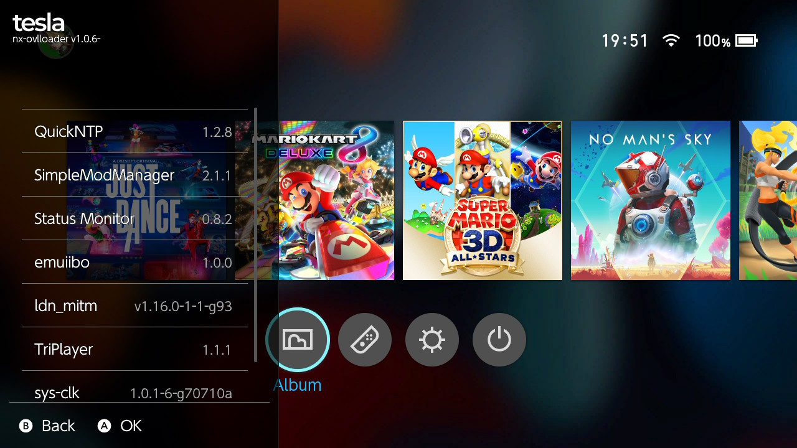

# Tesla-Menu

Tesla-Menu is an overlay menu developed by [WerWolv](https://github.com/WerWolv), Tesla-Menu is comparable to Rosalina menu on the 3DS and its purpose is to be able to load community made overlays for Homebrew apps and sysmodules that can be accessed at any time. Below you can find common use cases for Tesla-Menu. The official Github page for Tesla-Menu can be found [here](https://github.com/WerWolv/Tesla-Menu).

::: tip

**Dependencies**

Tesla-Menu is dependent on a [sysmodule](index#terminologies) called `nx-ovlloader`, this sysmodule is responsible for loading `ovlmenu.ovl` from `sd:/switch/.overlays`.

:::

### Common use cases for Tesla-Menu:
- Load community made Tesla-Menu overlays
- Viewing the temperatures/clock speeds of your hardware
- Editing sysmodule configs on the fly (if applicable)
- Editing Homebrew app configs on the fly (if applicable)
- Toggling cheats easily
- Toggling sysmodules

## Installation requirements:
- An archive manager like [7-Zip](https://www.7-zip.org/)
- The latest release of [Tesla-Menu](https://github.com/WerWolv/Tesla-Menu/releases/tag/v1.2.3) (the `ovlmenu.zip` file)
- The latest release of [nx-ovlloader](https://github.com/WerWolv/nx-ovlloader/releases/tag/v1.0.7) (the `nx-ovlloader.zip` file)

## Installation instructions:
1. Boot into hekate and go to `Tools` > `USB Tools` > `SD Card`, then plug your Switch into your PC via USB.
1. Your microSD card should now be accessible on your PC, open it.
1. Extract both `.zip` files to a location on your computer.
    - If your archive manager allows for it, you can also simply open the `.zip` files directly.
1. Copy the *contents* of each (extracted) `.zip` file to the root of your microSD card.
    - **Optional:** You can verify if you've installed Tesla-Menu and nx-ovlloader correctly, you should have a folder called `420000000007E51A` (nx-ovlloader) in `sd:/atmosphere/contents` and the `ovlmenu.ovl` (Tesla-Menu) file in `sd:/switch/.overlays`.
1. Boot into CFW.

## Opening Tesla-Menu
Tesla-Menu can be opened by pressing `L` + `R Stick press (R3)` + `DPAD down`, assuming you use the default configuration.



## Changing the button combination

If you wish to change the default button configuration, see the instructions below:

1. Navigate to `sd:/config` on your microSD card.
1. Create a folder named `tesla` if it doesn't exist already.
1. Create a file named `config.ini` in `sd:/config/tesla`.
1. Paste the following text inside of `config.ini`:
    ```
    [tesla]
    key_combo=L+R+RS
    # A, B, X, Y, LS, RS, L, R, ZL, ZR, PLUS, MINUS, DLEFT, DUP, DRIGHT, DDOWN, SL, SR
    ```
1. Change the `key_combo` value to anything you desire and save the file. The accepted inputs are mentioned on the third line.

## Commonly used Tesla-Menu overlays
- [Status-Monitor-Overlay](https://github.com/masagrator/Status-Monitor-Overlay)
- [EdiZon overlay](https://github.com/proferabg/EdiZon-Overlay)
- [QuickNTP](https://github.com/nedex/QuickNTP)
- [Emuiibo](https://github.com/XorTroll/emuiibo) (this requires you to also install the Emuiibo sysmodule)
- [TriPlayer](https://github.com/DefenderOfHyrule/TriPlayer) (this requires you to also install the TriPlayer sysmodule)
- [ldn_mitm](https://github.com/DefenderOfHyrule/ldn_mitm) (this requires you to also install the ldn_mitm sysmodule)
- [Fizeau](https://github.com/averne/Fizeau) (this requires you to also install the Fizeau sysmodule)

## Troubleshooting
### My Switch crashes on boot after I installed Tesla-Menu/nx-ovlloader!:

**Cause:** If your Switch crashes with Error code `2001-0123 (0xf601)` and Title ID `420000000007E51A`, you didn't successfully install Tesla-Menu or you aren't using the latest release of Tesla-Menu, re-follow the installation instructions above.

### My Switch crashes when I open an overlay via Tesla-Menu!:

**Cause:** If your Switch crashes with Error code `2001-0123 (0xf601)` and Title ID `420000000007E51A`, the overlay you're trying to open/use isn't up to date. Check its source repository for updates.

- If this overlay doesn't have an updated release, you may have to look for a forked (updated) release or compile it yourself using the latest `libtesla` library. The latter is for developers (or advanced users).

### Tesla-Menu is only showing while on the main menu and not in-game!:

**Cause:** This issue will only happen when the Switch is docked, ensure that you've set the "Screen size" in `System Settings` > `TV Output` to 100%. Adjust your TV/monitor to fit the entirety of the screen of your Switch using its OSD (On Screen Display) or remote.

### Tesla-Menu isn't opening when I press the correct button combination!:

Assuming you've followed the installation instructions successfully, this is probably due to the archive bit being set on one or more folders/files on your microSD card. This is usually the result of copying files to a microSD card via a Mac. If you are experiencing this issue, try running the archive bit fixer utility via hekate for all files.

This can be done by booting into hekate and going to `Tools` > `Arch bit • RCM Touch • Pkg1/2` > `Fix Archive Bit`.
