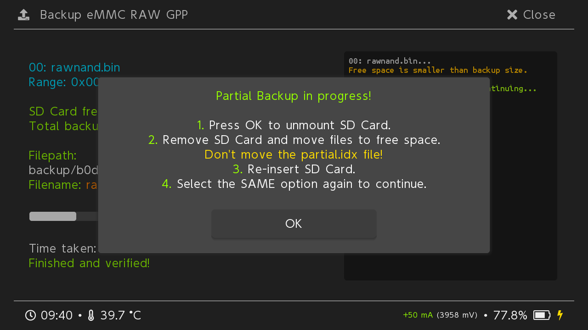

# Making Essential Backups

## Making a NAND Backup

::: danger

**Important**

A NAND backup is crucial to have, it's a full backup of the internal storage of your Switch and can be used to restore the device to a working state in case of emergencies. **DO NOT SKIP THIS STEP**

Once the backup is finished, **keep it somewhere safe.** The best backup is the one you have but never need, and the worst backup is the one you need but never made. To save space, it's recommended to compress the end-result with a `.zip` file or something similar.

It's highly recommended that you use an microSD card that is formatted to FAT32 and has at least 32 gigabytes of space free. This will still work on smaller cards, but it's not ideal.

:::

### Instructions:

1. Enter RCM and inject the hekate payload.
    - If you use a modchipped Switch, you can simply just turn your Switch on with the hekate payload renamed to `payload.bin` on the root of your microSD card.
1. Use the touch screen or Joy-Cons to navigate to `Tools` > `Backup eMMC`.
1. Tap on `eMMC BOOT0 & BOOT1`
    - This should only take a few seconds, but if your microSD card is very slow, it may take around a minute.
1. Tap on `Close` to continue, then tap on `eMMC RAW GPP`
    - This will take a long time. Expect it to take between 10 minutes to an hour (or more, if your microSD card is very slow).
    - If your microSD card has less than 32GB of space available, please follow the "**About microSD cards with less than 32GB of free space**" instructions at the end of this section instead.
1. Go to the top right and press `Close` > `Home`.
1. Navigate to `Tools` > `USB tools` > `SD card` and plug your Switch into your PC via USB.
1. Copy the `backup` folder on your microSD card to a safe location on your PC.
1. Once done, you may delete the `backup` folder from the root of your microSD card and eject the `UMS` device safely from within your computer's operating system, then return to hekate's `Home` menu.

::: details About microSD cards with less than 32GB of free space (Click to unfold)

On FAT32 formatted microSD cards or cards that have less than 32 gigabytes of space available, the NAND backup will be split into 1 or 2 gigabyte parts.

hekate will stop producing these parts when it runs out of space. When this happens, do the following:

1. Press `OK` when hekate tells you to back up your stuff. 
    { width=600 }
1. Press `Close` > `Close` > `USB Tools` > `SD Card` and connect your Switch to your PC via USB.
1. Your microSD card should now be accessible on your PC, move the `backup` folder on the root of your microSD card to a safe location on your PC.
    - *If* you are prompted to merge folders, do so.
1. Eject the `UMS` device safely from within your computer's operating system and close the UMS window in hekate.
1. Press `Close` > `Backup eMMC` > `eMMC RAW GPP` and continue backing up your NAND.
1. Repeat step 2-5 until the NAND is completely dumped.
1. Once done, return to hekate's `Home` menu.

:::

## Booting into CFW

::: tip

Click the link below to continue to Launching **emuMMC**!

[Launching CFW (emuMMC)](launching_cfw?tab=instructions-for-emummc)

:::

::: tip

Click the link below to continue to Launching **sysCFW**!

[Launching CFW (sysCFW)](launching_cfw?tab=instructions-for-syscfw)

:::

::: details Frequently Asked Questions about this page

- **Q: Why is making a NAND backup considered crucial?**

    A: A NAND backup contains a complete snapshot of the internal files of your Switch, including console-specific files that cannot be regenerated if accidentally lost. This is why it is **mandatory** to keep at least one copy of your NAND backup in a safe place, even if it takes a lot of space. The consequence to not having one is, at best, a Switch that cannot connect to Nintendo Network, or at worst, a full brick. However, it is important to note that it is nearly impossible to permanently brick a hackable Nintendo Switch.

:::
